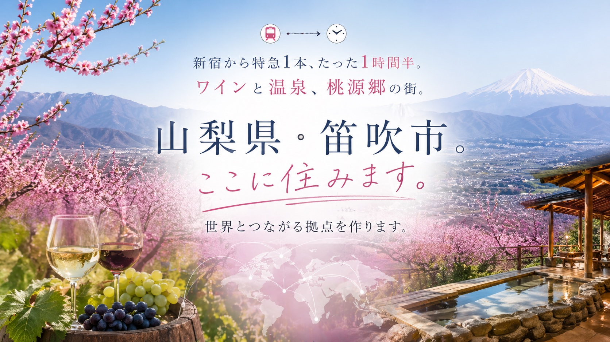

# 笛吹移住クラファン LP — ルール & スキル集

## プロジェクト概要
- **URL**: https://cf-fuefuki.fomus.jp
- **GitHub**: https://github.com/masuo444/CF-fuefuki-
- **Vercel プロジェクト**: cf-fuefuki-zrc5（kei's projects）
- **決済**: shop.fomus.jp 経由
- **締切**: 2026年6月6日 23:59

---

## 技術構成

- **単一ファイル**: `index.html`（ビルドなし、フレームワークなし）
- **CSS**: CSS変数 + Grid + メディアクエリ
- **フォント**: Noto Serif JP / Noto Sans JP / Cormorant Garamond（Google Fonts）
- **ブレークポイント**: 900px / 600px

### CSS 変数
```css
--cream: #EFE8D5
--olive: #3E5128
--olive-mid: #556B38
--olive-light: #768A58
--dark: #1C1E17
--gold: #9B8440
```

---

## デプロイルール

```bash
# 作業ディレクトリ（元ディレクトリに権限問題が出た場合）
git clone https://github.com/masuo444/CF-fuefuki-.git /tmp/cf-fuefuki-work
cd /tmp/cf-fuefuki-work

# GitHub push → Vercel 自動デプロイ（メイン）
git add . && git commit -m "..." && git push origin main

# 手動デプロイ（必要時）
npx vercel --prod
```

---

## 画像ルール

### PC / スマホ切り替え
`<picture>` + `<source media="(max-width: 600px)">` で切り替え。

```html
<picture>
  <source media="(max-width: 600px)" srcset="スマホヒーロー.jpg">
  
</picture>
```

対象セクション: ヒーロー / ストーリー3枚 / 応援メニュー / 未来 / スケジュール

### 画像圧縮（PNG → JPEG）
```bash
sips -s format jpeg -s formatOptions 85 "元ファイル.png" --out "出力.jpg"
```
- 目安: 2MB超のPNGは必ず圧縮 → 500KB前後に
- OGP用画像は **ASCII名**（`ogp.jpg`）で用意する

### ヒーロー画像の高速化
```html
<link rel="preload" as="image" href="ヒーロー.jpg" media="(min-width: 601px)">
<link rel="preload" as="image" href="スマホヒーロー.jpg" media="(max-width: 600px)">

```

---

## OGP / SEO

```html
<meta property="og:url" content="https://cf-fuefuki.fomus.jp/">
<meta property="og:image" content="https://cf-fuefuki.fomus.jp/ogp.jpg">
<meta name="twitter:card" content="summary_large_image">
<link rel="icon" href="data:image/svg+xml,<svg ...>🏔</svg>">
<link rel="apple-touch-icon" href="ogp.jpg">
```

---

## コンテンツルール

### プラン
- 番号は **01〜09 の連番**（表示番号と商品番号は別）
- 価格順は**意図的**なので変えない
- ボタン文言: 「詳細・応援はこちら →」
- ボタン先: shop.fomus.jp の各商品URL

| # | プラン | 価格 | 限定 |
|---|---|---|---|
| 01 | お気持ち支援 | ¥5,000 | なし |
| 02 | 全力応援 | ¥10,000 | なし |
| 03 | バーカウンタースポンサー | ¥30,000 | 5枠 |
| 04 | 車スポンサー | ¥50,000 | 4枠 |
| 05 | 生活インフラスポンサー | ¥20,000 | 10枠 |
| 06 | AI合宿（1泊2日） | ¥50,000 | 10枠 |
| 07 | AI導入コンサル（法人） | ¥100,000 | 3社 |
| 08 | AI導入サポート（法人） | ¥200,000 | 3社 |
| 09 | ゴールドメンバー | ¥200,000 | 4枠 |

### 拠点名
「まっすーハウス」ではなく **「笛吹BASE」**

### 連絡先
- Instagram: [@masumasumasuo7](https://www.instagram.com/masumasumasuo7/)
- メール: contact@fomus.jp

---

## デザインルール

- ヒーローCTAボタン（「応援する」）: **白地 + オリーブ文字**（スマホは緑）
- カードボタン（「詳細・応援はこちら」）: オリーブ緑
- 締切バッジ: 右上固定（`.deadline-badge`）
- スティッキーCTA: 画面下部固定（`.sticky-cta`）

---

## シェアボタン

締切CTAセクション直後の `.share-section` に設置。

- LINE: `https://social-plugins.line.me/lineit/share?url=https%3A%2F%2Fcf-fuefuki.fomus.jp%2F`
- X: `https://twitter.com/intent/tweet?url=...`
- Facebook: `https://www.facebook.com/sharer/sharer.php?u=...`

---

## ファイル構成

```
/
├── index.html          # メインLP（全CSS込み）
├── ogp.jpg             # OGP用画像（ASCII名必須）
├── ヒーロー.jpg         # PC用ヒーロー
├── スマホヒーロー.jpg   # スマホ用ヒーロー
├── １.jpg / ２.jpg / ３.jpg        # ストーリー画像（PC）
├── スマホ１.jpg〜スマホ３.jpg      # ストーリー画像（スマホ）
├── 応援メニュー.jpg / スマホ応援メニュー.jpg
├── 未来.jpg / スマホ未来.jpg
├── スケジュール.jpg / スマホスケジュール.jpeg
├── プロフィール.jpg
└── クラファンプラン/
    └── 1.png 〜 9.png  # プランカード画像
```
